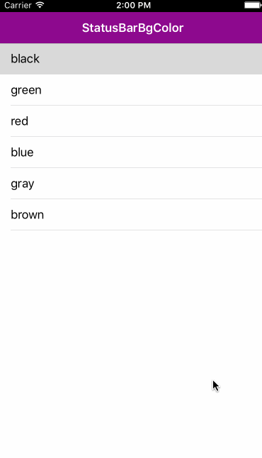

# LPStatusBarBackgroundColor

Change UIStatusBar backgroundColor dynamically which made via runtime &amp; swift

# Installation

```swift
pod 'LPStatusBarBackgroundColor-swift', '~> 1.0.0'
```
# Additional

Objective C version is [here](https://github.com/litt1e-p/LPStatusBarBackgroundColor) 

# Usage

```swift
//import
import LPStatusBarBackgroundColor_swift

//set navigationBar's backgroundImage with height 44

navigationController!.navigationBar.setBackgroundImage(UIImage.imageWithColor(yourColor, size: CGSizeMake(
UIScreen.mainScreen().bounds.size.width
, 44)), forBarPosition: UIBarPosition.Any, barMetrics: UIBarMetrics.Default)

/** in navigationController */
self.navigationBar.statusBarBackgroundColor = UIColor.blackColor() //any color you want

/** in navigationController's rootViewController */
self.navigationController?.navigationBar.statusBarBackgroundColor = UIColor.brownColor //any color you want
```

# Screenshot



# Release Notes

- 1.0.0

# License

MIT 


